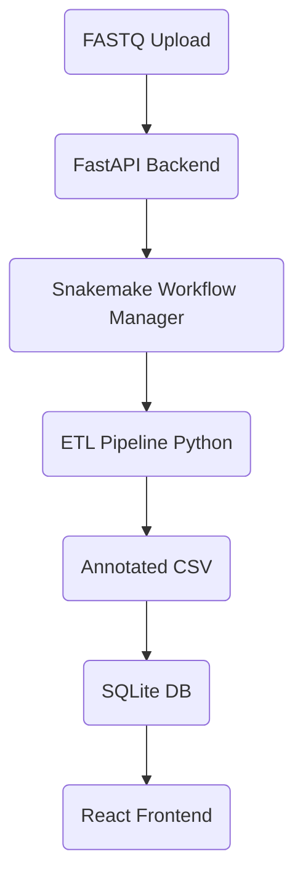
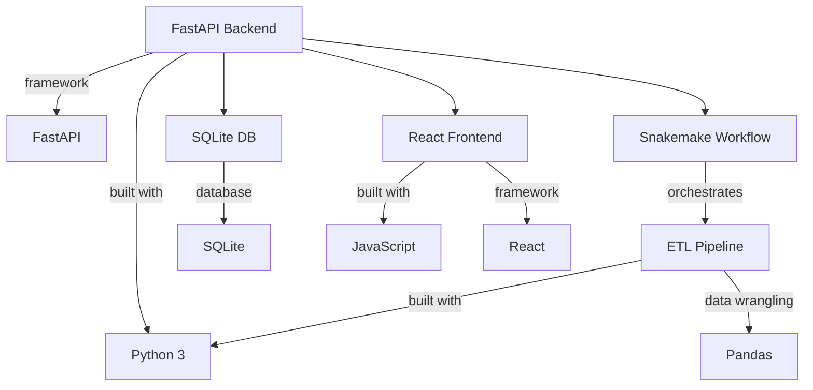

# Genomic ETL Project

## 🗺️ Architecture Diagram



## Technologies Used Diagram



## Backend (FastAPI)
- Run: `uvicorn main:app --reload`
- Endpoints:
  - `/` : Health check
  - `/upload` : Upload genomic data file
  - `/results` : Query processed results


## ETL
- Place Snakemake/Nextflow pipelines and scripts here

### Running the Snakemake Pipeline

1. **Install Snakemake** (if not already):
  ```bash
  pip install snakemake
  ```
2. **Change to the etl directory:**
  ```bash
  cd etl
  ```
3. **Create a sample FASTQ file (if needed):**
  ```bash
  echo -e '@SEQ_ID\nGATTACA\n+\n!!!!!!!' > sample.fastq
  ```
4. **Run the pipeline:**
  ```bash
  snakemake --cores 1
  ```
5. **Output:**
  - The pipeline will generate `sample.vcf` and `annotated_variants.csv` in the `etl` directory.

You can customize the pipeline by editing the `Snakefile` and scripts in `etl/scripts/`.


## Frontend
The React app provides a curation and review UI for annotated variants.

### Setup & Usage
1. Install dependencies:
  ```bash
  cd frontend
  npm install
  ```
2. Start the development server:
  ```bash
  npm start
  ```
3. Open [http://localhost:3000](http://localhost:3000) in your browser.

The app will fetch and display annotated variant data from the backend API.
## Testing & CI/CD

### Running Unit Tests
Unit tests for the FastAPI backend are located in `backend/tests/`.

To run tests locally:
```bash
cd backend
pytest
```

### Continuous Integration
This project uses GitHub Actions for CI/CD. On every push or pull request, the workflow defined in `.github/workflows/python-app.yml` will:
- Install dependencies
- Run backend unit tests
- Report status in GitHub

## Database: SQLite and SQL Server

Currently, the backend uses SQLite for simplicity and local development. To use SQL Server (MSSQL) in production, update the database connection logic in `backend/main.py` and adjust deployment settings as needed.

See [FastAPI SQL Server documentation](https://fastapi.tiangolo.com/advanced/async-sql-databases/) for migration guidance.

---

### Next Steps
- Implement ETL scripts in `etl/`
- Scaffold React app in `frontend/`
- Connect backend to SQL Server
- Add unit tests and CI/CD
