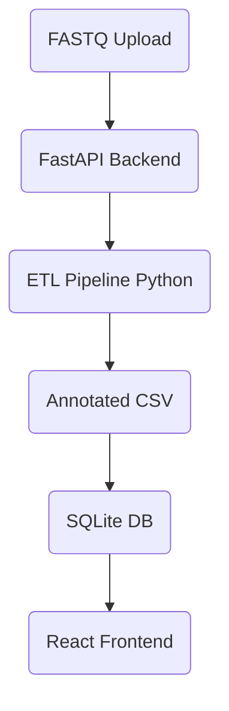
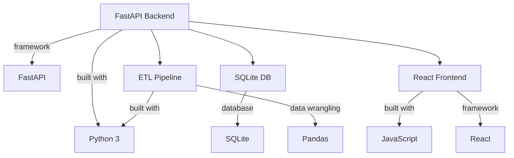

# Genomic ETL Project

## 🗺️ Architecture Diagram

## Technologies Used Diagram

## Backend (FastAPI)
- Run: `uvicorn main:app --reload`
- Endpoints:
  - `/` : Health check
  - `/upload` : Upload genomic data file
  - `/results` : Query processed results

## ETL
- Place Snakemake/Nextflow pipelines and scripts here

## Frontend
- React app for curation and review UI

---

### Next Steps
- Implement ETL scripts in `etl/`
- Scaffold React app in `frontend/`
- Connect backend to SQL Server
- Add unit tests and CI/CD
